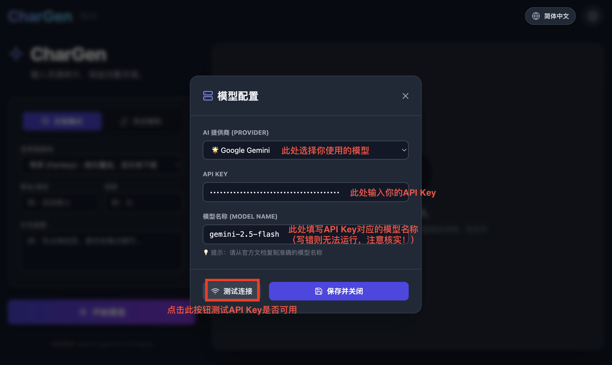

# 🎭 CharGen - AI Character Generator

"Input fragments of inspiration, forge complete souls."

CharGen is an intelligent character generation tool based on React and AI Large Language Models (LLMs). It's designed for writers, comic artists, character designers, game developers, TRPG (tabletop role-playing game) players, and role-playing enthusiasts. Simply provide keywords or select a world setting, and AI will generate a vivid, detail-rich character profile for you.


## ✨ Key Features

### 🧠 Multi-Model Support

- **Google Gemini** (Native support, auto-detects AIza prefix keys)
- **OpenAI / ChatGPT** (Supports gpt-4o, gpt-3.5, etc.)
- **Anthropic Claude** (Supports claude-3.5-sonnet, etc.)
- **Chinese LLMs** (Zhipu ChatGLM, Moonshot Kimi, Tongyi Qwen, etc.)
- **Local Models** (Ollama, offline operation, privacy-safe)

### 🎲 Dual Generation Modes

- **Custom Mode**: Specify world setting, profession, gender, and keywords for precise customization.
- **Random Mode**: One-click generation for unexpected inspiration.

### 📝 In-Depth Character Generation

- **Basic Profile**: Name, age, race, alignment, occupation.
- **Psychological Profile**: MBTI personality, core desire, fear, fatal flaw, high concept, quirks.
- **Appearance Features**: Detailed appearance description and feature list.
- **Background Story**: Rich life experiences and dark secrets.

### 🤖 NPC System Prompt

Automatically generates a System Prompt that can be directly copied into AI conversations (like ChatGPT), allowing AI to instantly roleplay as the character and chat with you.

### 🎨 Visual Studio (Image Prompts)

Automatically generates English image prompts compatible with Stable Diffusion or Midjourney, supporting 6 professional visual types:
- Portrait
- Three Views (Turnaround)
- Concept Breakdown
- Expression Sheet
- Scale Chart
- Action Poses

### 🌍 Multi-Language Interface

Supports 7 languages: 简体中文, English, Español, Français, Русский, 日本語, 한국어

### 🌓 Light/Dark Mode

Complete dual-theme support with all UI elements perfectly adapted for a comfortable visual experience.

---

## 🚀 Quick Start

### Online Access

**Visit the GitHub-deployed version directly:**

👉 [https://karmacoke.github.io/chargen/](https://karmacoke.github.io/chargen/) Start designing your character now!

### Local Setup

Want to run this project on your computer? Choose the appropriate method for your operating system:

#### 1. Prerequisites (All Systems)

Make sure you have the following software installed:

- **Node.js** (Recommended: LTS version)
- **Git** (For downloading the code)

#### 🍎 Option A: macOS Users

1. **Open Terminal**: Press `Command + Space`, type `Terminal` and press Enter.

2. **Clone the repository**:
   ```bash
   git clone https://github.com/Karmacoke/chargen.git
   ```

3. **Navigate to directory and install dependencies**:
   ```bash
   cd my-chargen
   npm install
   ```

4. **Start the project**:
   ```bash
   npm start
   ```

#### 🪟 Option B: Windows Users

1. **Open Command Prompt**: Press `Win + R`, type `cmd` or `powershell`, then click OK.

2. **Clone the repository**:
   ```bash
   git clone https://github.com/Karmacoke/chargen.git
   ```

3. **Navigate to directory and install dependencies**:
   ```bash
   cd my-chargen
   npm install
   ```

4. **Start the project**:
   ```bash
   npm start
   ```

After successful startup, your browser will automatically open `http://localhost:3000`, and you can start using it!

---

## ⚙️ Configuration Guide



### Important:

**Before generating characters, click the gear icon ⚙️ in the top-right corner to configure the model.**

### 1. Using Google Gemini (Recommended)

- Select **Gemini** model.
- Enter your API Key starting with `AIza` in the **API Key** field.
- Fill in the corresponding model name in the **Model Name** field (e.g., `gemini-2.0-flash-exp`, `gemini-2.5-flash`).

### 2. Using OpenAI

- Select **OpenAI** model.
- Enter your API Key starting with `sk-` in the **API Key** field.
- Fill in the corresponding model name in the **Model Name** field (e.g., `gpt-4o`, `gpt-4o-mini`).

### 3. Using Anthropic Claude

- Select **Claude** model.
- Enter your Claude API Key in the **API Key** field.
- Fill in the corresponding model name in the **Model Name** field (e.g., `claude-3-5-sonnet-20241022`).

### 4. Using Chinese LLMs (DeepSeek / Kimi / Qwen, etc.)

- Select the corresponding model (**ChatGLM** / **Kimi** / **Qwen**).
- Enter your API Key in the **API Key** field (usually starts with `sk-`).
- Fill in the corresponding model name in the **Model Name** field (e.g., `deepseek-chat`, `moonshot-v1-8k`, `qwen-max`).

### 5. Using Local Ollama

- Set **AI Provider** to **Local Ollama**.
- Ensure you have Ollama running locally with `ollama run deepseek-r1` (or other models).
- Default address is `http://localhost:11434`.

---

## 🛠️ Tech Stack

- **Framework**: React 19.2.4 (Hooks)
- **Build Tool**: Create React App 5.0.1
- **Styling**: Tailwind CSS 3.4.17 (Responsive design, Light/Dark themes)
- **Icons**: Inline SVG icon library
- **API Integration**: Fetch API (Streamless)
- **State Management**: React Hooks + localStorage persistence
- **Internationalization**: Custom i18n module

---

## 📁 Project Structure

```
my-chargen/
├── public/               # Static assets
├── src/
│   ├── components/      # UI components
│   │   ├── Icons.jsx           # Icon library
│   │   ├── InputForm.jsx       # Input form
│   │   ├── ResultDisplay.jsx   # Result display
│   │   └── SettingsPanel.jsx   # Settings panel
│   ├── hooks/           # Custom Hooks
│   │   └── useCharacterGeneration.js  # Core business logic
│   ├── utils/           # Utility functions
│   │   ├── apiAdapters.js      # API adapters
│   │   ├── helpers.js          # Helper functions
│   │   └── fetchWithTimeout.js # Timeout control
│   ├── i18n/            # Internationalization
│   │   └── translations.js     # Multi-language configs
│   ├── CharacterGenerator.jsx  # Main component
│   └── index.js         # App entry point
├── tailwind.config.js   # Tailwind configuration
└── package.json         # Project configuration
```

---

## 🎨 Special Features

### Anti-Cliché System

Provides 5 levels of character design styles:
- **Ordinary (0/4)** - Classic archetypal character
- **Surprising (1/4)** - Character with small unexpected traits
- **Memorable (2/4)** - Character with inner contradictions
- **Unconventional (3/4)** - Character strongly defying expectations
- **Extreme Rebel (4/4)** - Character completely shattering conventions

### World Setting Templates

Supports 7 preset world settings:
- 🏰 Fantasy
- 🤖 Cyberpunk
- 🏙️ Modern Urban
- 🚀 Space Opera
- 🧟 Post-Apocalyptic
- ⚔️ Wuxia/Xianxia
- 🦑 Lovecraftian Horror
- ✏️ Custom World Setting

### One-Click Export

- **Markdown Document** - Complete character profile
- **NPC System Prompt** - Direct use in AI conversations
- **Image Prompts** - Drawing prompts for 6 visual types
- **JSON Data** - Structured data for programmatic integration

---

## 🤝 Contributing

We welcome Issues and Pull Requests! If you have better Prompt optimization suggestions or new feature ideas, please feel free to share.

### How to Contribute

1. Fork this repository
2. Create your feature branch (`git checkout -b feature/AmazingFeature`)
3. Commit your changes (`git commit -m 'Add some AmazingFeature'`)
4. Push to the branch (`git push origin feature/AmazingFeature`)
5. Open a Pull Request

---

## 📄 License

This project is open-sourced under the **MIT License**. This means you can freely use, modify, and distribute the code.

---

## 🙏 Acknowledgments

Thanks to all developers who have provided suggestions and contributions to this project!

---

## 📞 Contact

If you have questions or suggestions, feel free to reach out:

- **GitHub Issues**: [Submit an issue](https://github.com/Karmacoke/chargen/issues)
- **Project Homepage**: [https://github.com/Karmacoke/chargen](https://github.com/Karmacoke/chargen)

---

**⭐ If this project helps you, please give us a Star!**
