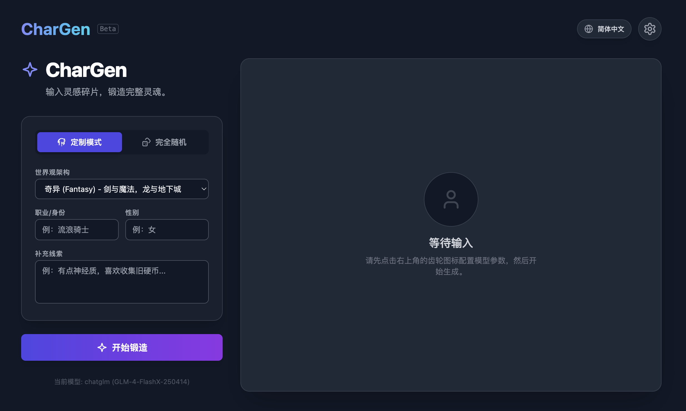

# 🎭 CharGen - AI 角色生成器

"输入灵感碎片，锻造完整灵魂。"

CharGen 是一个基于 React 和 AI 大模型（LLM）的智能角色生成工具。它专为作家、漫画家、角色设计师、游戏开发者、TRPG (跑团) 玩家和角色扮演爱好者设计。只需提供简单的关键词或选择世界观，AI 就能为你生成一个有血有肉、细节丰富的角色档案。

# ✨ 功能亮点

🧠 多模型支持：

Google Gemini (原生支持，自动识别 AIza 开头 Key)

OpenAI / ChatGPT (支持 gpt-4o, gpt-3.5 等)

国产大模型 (DeepSeek、Kimi、通义千问等，通过兼容模式支持)

本地模型 (Ollama，无需联网，隐私安全)

🎲 双重模式：

定制模式：指定世界观、职业、性别和关键词，精准定制。

完全随机：一键生成，寻找意外的灵感。

📝 深度设定生成：

基础档案：姓名、年龄、种族、阵营、职业。

心理侧写：MBTI 人格、核心欲望、恐惧、致命弱点。

背景故事：详实的生平经历与不可告人的秘密。

🤖 NPC 专属指令 (System Prompt)：

自动生成一段能够直接复制到 AI 对话（如 ChatGPT）中的 System Prompt，让 AI 立刻扮演该角色与你对话。

🎨 绘图咒语 (Image Prompt)：

自动生成适配 Nano Banana Pro; Stable Diffusion 或 Midjourney 的英文绘画提示词。

🌍 多语言界面：支持简中、英语、日语、韩语等多种语言切换。

# 🛠️ 技术栈

框架：React (Hooks)

脚手架：Create React App

样式：Tailwind CSS (响应式设计，暗黑模式)

图标：Lucide React

API 交互：Fetch API (Streamless)

# 🚀 快速开始 （可直接访问本项目在Github上部署的地址： https://karmacoke.github.io/chargen/ 立即开始设计你的角色）

## 本地运行

想要在你的电脑上运行这个项目？请根据你的操作系统选择对应的方案：

1. 环境准备 (所有系统)

确保你的电脑上已经安装了以下基础软件：

Node.js (推荐下载 LTS 版本)

Git (用于下载代码)

### 🍎 方案 A：macOS 用户

打开终端：按 Command + Space (空格键)，输入 Terminal 并回车。

下载代码：

git clone [https://github.com/Karmacoke/chargen.git](https://github.com/Karmacoke/chargen.git)

进入目录并安装依赖：

cd my-chargen
npm install

启动项目：

npm start

### 🪟 方案 B：Windows 用户

打开命令行：按 Win + R 键，输入 cmd 或 powershell，然后点击确定。

下载代码：

git clone [https://github.com/Karmacoke/chargen.git](https://github.com/Karmacoke/chargen.git)

进入目录并安装依赖：

cd my-chargen
npm install

启动项目：

npm start

启动成功后，浏览器会自动打开 http://localhost:3000

你就可以开始使用了！

# ⚙️ 配置指南

点击界面右上角的 齿轮图标 ⚙️ 进行模型配置。

1. 使用 Google Gemini (推荐)

选择Gemini模型。

在 API Key 框中输入以 AIza 开头API Key。

无需填写 Base URL。

2. 使用 OpenAI

选择OpenAI模型。

在 API Key 框中输入以 sk- 开头API Key。

程序会自动识别并切换到 OpenAI 模式。

3. 使用 DeepSeek / Kimi / 其他模型

选择对应的模型。

在 API Key 框中输入 API Key（通常也是 sk- 开头）。

在 模型名称 栏填入对应的模型 ID (如 deepseek-chat)。

4. 使用本地 Ollama

将 AI 提供商 选为 Local Ollama。

确保本地已运行 ollama run deepseek-r1 (或其他模型)。

默认地址为 http://localhost:11434。

# 🤝 贡献 (Contributing)

欢迎提交 Issue 或 Pull Request！如果你有更好的 Prompt 优化建议或新功能想法，请随时告诉我。

# 📄 许可证 (License)

本项目基于 MIT License 开源。这意味着你可以免费使用、修改和分发代码。