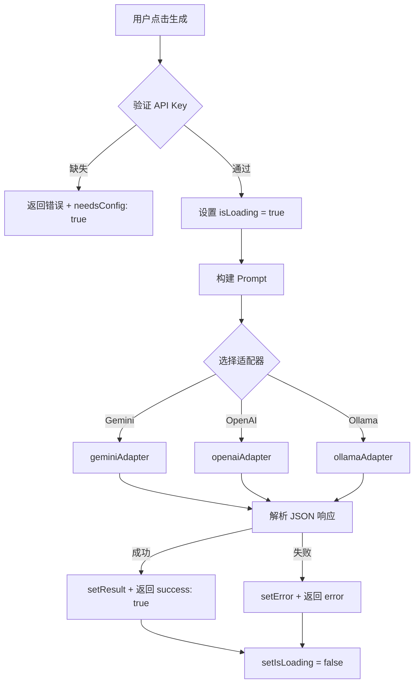

# hooks/ 模块文档

[根目录](../../CLAUDE.md) > [src](../CLAUDE.md) > **hooks**

> 最后更新: 2026-02-05 17:19:56

---

## 模块职责

`hooks/` 模块包含所有自定义 React Hooks，封装业务逻辑和副作用：

1. **useCharacterGeneration.js**: 核心业务逻辑 Hook，管理角色生成的完整生命周期

**设计原则**:
- 遵循 React Hooks 规范（以 `use` 开头）
- 封装所有状态管理和副作用（useEffect）
- 暴露状态和方法的统一接口
- 无 UI 依赖，可独立测试

---

## 入口与启动

### Hook 导入方式

```javascript
// 在 CharacterGenerator.jsx 中的使用
import { useCharacterGeneration } from './hooks/useCharacterGeneration';

const CharacterGenerator = () => {
  const {
    // 状态
    lang, mode, worldSettingKey, role, gender, keywords,
    isLoading, error, result, config, testStatus,

    // 方法
    setMode, setWorldSettingKey, setRole, setGender, setKeywords,
    changeLanguage, saveConfig, setConfig,
    handleTestConnection, handleGenerate
  } = useCharacterGeneration();

  // ... 使用状态和方法
};
```

---

## 对外接口

### useCharacterGeneration Hook

**返回值接口** (TypeScript 类型定义):

```typescript
interface UseCharacterGenerationReturn {
  // === 状态 ===
  lang: string;                           // 当前语言 ('zh' | 'en' | ...)
  mode: 'custom' | 'random';              // 生成模式
  worldSettingKey: string;                // 世界观 key
  role: string;                           // 角色职业
  gender: string;                         // 性别
  keywords: string;                       // 补充线索
  isLoading: boolean;                     // 生成中状态
  error: string;                          // 错误信息
  result: CharacterData | null;           // 生成结果
  config: AppConfig;                      // API 配置
  testStatus: 'testing' | 'success' | 'fail' | null;

  // === 方法 ===
  setMode: (mode: string) => void;
  setWorldSettingKey: (key: string) => void;
  setRole: (role: string) => void;
  setGender: (gender: string) => void;
  setKeywords: (keywords: string) => void;
  changeLanguage: (lang: string) => void;  // 切换语言并保存到 localStorage
  saveConfig: (config: AppConfig) => void; // 保存配置到 localStorage
  setConfig: (config: AppConfig) => void;  // 临时更新配置（不保存）
  handleTestConnection: () => Promise<void>; // 测试 API 连接
  handleGenerate: () => Promise<{          // 生成角色
    success?: boolean;
    needsConfig?: boolean;
    data?: CharacterData;
    error?: string;
  }>;
  setError: (error: string) => void;
  setTestStatus: (status: string | null) => void;
}
```

---

## 关键依赖与配置

### 外部依赖

```javascript
import { useState, useEffect } from 'react';
import { geminiAdapter, openaiAdapter, ollamaAdapter, testConnection }
  from '../utils/apiAdapters';
import { buildUserPrompt, buildSystemInstruction }
  from '../utils/helpers';
import { translations } from '../i18n/translations';
```

### 内部状态管理

```javascript
// 语言状态
const [lang, setLang] = useState('zh');

// 用户输入状态
const [mode, setMode] = useState('custom');
const [worldSettingKey, setWorldSettingKey] = useState('fantasy');
const [role, setRole] = useState('');
const [gender, setGender] = useState('');
const [keywords, setKeywords] = useState('');

// 运行状态
const [isLoading, setIsLoading] = useState(false);
const [error, setError] = useState('');
const [result, setResult] = useState(null);

// 配置状态
const [config, setConfig] = useState({
  provider: 'gemini',
  apiKey: '',
  baseUrl: '',
  model: 'gemini-1.5-flash'
});
const [testStatus, setTestStatus] = useState(null);
```

### 生命周期逻辑

```javascript
useEffect(() => {
  // 加载保存的配置
  const savedConfig = localStorage.getItem('chargen_config');
  if (savedConfig) {
    setConfig(JSON.parse(savedConfig));
  }

  // 加载保存的语言
  const savedLang = localStorage.getItem('chargen_lang');
  if (savedLang && translations[savedLang]) {
    setLang(savedLang);
  }
}, []); // 仅在组件挂载时执行
```

---

## 数据模型

### 配置对象 (AppConfig)

```typescript
interface AppConfig {
  provider: 'gemini' | 'openai' | 'ollama';
  apiKey: string;     // Gemini/OpenAI 必填，Ollama 不需要
  baseUrl: string;    // OpenAI/Ollama 必填，Gemini 不需要
  model: string;      // 模型名称
}

// 示例值
{
  provider: 'gemini',
  apiKey: 'AIzaSy...',
  baseUrl: '',
  model: 'gemini-2.0-flash-exp'
}
```

### 角色数据 (CharacterData)

详见 [src/CLAUDE.md 数据模型章节](../CLAUDE.md#数据模型)

---

## 核心逻辑流程

### 1. 角色生成流程 (handleGenerate)



### 2. 测试连接流程 (handleTestConnection)

```javascript
async function handleTestConnection() {
  // 1. 验证 API Key（Ollama 除外）
  if (config.provider !== 'ollama' && !config.apiKey) {
    setTestStatus('fail');
    return;
  }

  // 2. 设置测试中状态
  setTestStatus('testing');

  // 3. 调用 testConnection 工具函数
  const success = await testConnection(config);

  // 4. 设置结果状态
  setTestStatus(success ? 'success' : 'fail');

  // 5. 成功后 2 秒自动清除状态
  if (success) {
    setTimeout(() => setTestStatus(null), 2000);
  }
}
```

### 3. 配置保存流程 (saveConfig)

```javascript
function saveConfig(newConfig) {
  // 1. 更新 React 状态
  setConfig(newConfig);

  // 2. 持久化到 localStorage
  localStorage.setItem('chargen_config', JSON.stringify(newConfig));

  // 3. 清除错误信息
  setError('');
}
```

---

## 测试与质量

### 测试覆盖缺口

| 功能 | 单元测试 | 集成测试 |
|-----|---------|---------|
| handleGenerate | ❌ 无 | ❌ 无 |
| handleTestConnection | ❌ 无 | ❌ 无 |
| saveConfig | ❌ 无 | ❌ 无 |
| changeLanguage | ❌ 无 | ❌ 无 |
| localStorage 交互 | ❌ 无 | ❌ 无 |

### 建议补充的测试

#### 1. Hook 渲染测试
```javascript
// __tests__/useCharacterGeneration.test.js
import { renderHook } from '@testing-library/react';
import { useCharacterGeneration } from '../useCharacterGeneration';

test('初始状态正确', () => {
  const { result } = renderHook(() => useCharacterGeneration());

  expect(result.current.lang).toBe('zh');
  expect(result.current.mode).toBe('custom');
  expect(result.current.isLoading).toBe(false);
  expect(result.current.result).toBe(null);
});
```

#### 2. 配置保存测试
```javascript
test('saveConfig 正确保存到 localStorage', () => {
  const { result } = renderHook(() => useCharacterGeneration());

  const newConfig = {
    provider: 'openai',
    apiKey: 'sk-test123',
    baseUrl: 'https://api.openai.com/v1',
    model: 'gpt-4'
  };

  act(() => {
    result.current.saveConfig(newConfig);
  });

  expect(localStorage.getItem('chargen_config')).toBe(JSON.stringify(newConfig));
  expect(result.current.config).toEqual(newConfig);
});
```

#### 3. API 调用测试
```javascript
test('handleGenerate 成功生成角色', async () => {
  // Mock apiAdapters
  jest.mock('../utils/apiAdapters', () => ({
    geminiAdapter: jest.fn().mockResolvedValue(mockCharacterData)
  }));

  const { result } = renderHook(() => useCharacterGeneration());

  // 设置配置
  act(() => {
    result.current.saveConfig({
      provider: 'gemini',
      apiKey: 'test-key',
      model: 'gemini-2.0-flash-exp'
    });
  });

  // 执行生成
  let generateResult;
  await act(async () => {
    generateResult = await result.current.handleGenerate();
  });

  expect(generateResult.success).toBe(true);
  expect(result.current.result).toEqual(mockCharacterData);
  expect(result.current.isLoading).toBe(false);
});
```

#### 4. 错误处理测试
```javascript
test('缺少 API Key 时返回错误', async () => {
  const { result } = renderHook(() => useCharacterGeneration());

  let generateResult;
  await act(async () => {
    generateResult = await result.current.handleGenerate();
  });

  expect(generateResult.needsConfig).toBe(true);
  expect(result.current.error).toContain('API Key');
});
```

---

## 常见问题 (FAQ)

### Q1: 为什么使用自定义 Hook 而不是 Context？
**A**:
- 该应用状态不需要跨多层组件传递
- Hook 更轻量，无需 Provider 包裹
- 更容易测试（renderHook）
- 如果未来需要多实例，Hook 更灵活

### Q2: 如何调试 Hook 内部状态？
**A**:
```javascript
// 在组件中添加
useEffect(() => {
  console.log('Current State:', { lang, mode, config, result });
}, [lang, mode, config, result]);
```

### Q3: 如何添加新的状态字段？
**A**:
1. 在 Hook 内部添加 `useState`
2. 在返回对象中暴露状态和 setter
3. 更新 TypeScript 类型定义（如果使用）

### Q4: 为什么 handleGenerate 返回一个对象？
**A**:
返回值用于通知调用者生成结果：
- `needsConfig: true` → 打开设置面板
- `success: true, data` → 成功，可选的后续操作
- `error` → 失败，可选的错误处理

### Q5: localStorage 失败会怎样？
**A**:
代码已做容错处理：
- 读取失败 → 使用默认值
- 写入失败 → 仅 console 警告，不影响功能
- 建议添加 try-catch 增强健壮性

---

## 相关文件清单

```
src/hooks/
└── useCharacterGeneration.js  (179 行) - 核心业务逻辑 Hook

依赖关系:
  ├── React (useState, useEffect)
  ├── ../utils/apiAdapters (API 调用)
  ├── ../utils/helpers (Prompt 构建)
  └── ../i18n/translations (多语言)
```

---

## 变更记录

- **2026-02-05 17:19**: 初始化 Hook 模块，从主组件中提取业务逻辑
- 建议下一步：补充完整测试套件，增加错误边界处理

---

_此文档自动生成。修改代码后请同步更新本文档。_
